# Monitoramento Ambiental da Represa São Lourenço

[](https://doi.org/10.5281/zenodo.22838354)
[](https://mauriciorschmitt.github.io/saolourencoalert/)

Sistema automatizado de monitoramento ambiental por sensoriamento remoto da
Represa São Lourenço, em Mafra (SC), com foco na detecção de expansão de
macrófitas aquáticas.

O sistema consulta periodicamente o catálogo Sentinel-2, seleciona a cena mais
adequada, calcula índices espectrais sobre a área do reservatório, compara o
resultado com uma referência climatológica mensal e publica tudo em um painel
web — sem intervenção manual.

**Painel:** https://mauriciorschmitt.github.io/saolourencoalert/

---

## Como funciona

```mermaid
flowchart TD
    A[Sentinel-2 L2A<br/>Copernicus Data Space] --> B[Statistical API<br/>janela de 30 dias]
    B --> C[Máscara SCL<br/>remove nuvem, sombra, cirro]
    C --> D[Evalscript<br/>NDVI · NDWI · NDMI]
    D --> E[Média dos pixels válidos<br/>dentro da AOI]
    E --> F{Fração válida<br/>≥ mínimo?}
    F -- não --> G[Cena descartada]
    F -- sim --> H[z = &#40;NDVI − μ&#41; / σ<br/>climatologia do mês]
    H --> I{z ≥ 2,0?}
    I -- sim --> J[ALERTA<br/>Telegram · WhatsApp · e-mail]
    I -- não --> K[Registro normal]
    J --> L[historico.csv + painel web]
    K --> L
```



O cálculo dos índices roda do lado do servidor, via *evalscript* do Sentinel
Hub, o que evita baixar imagens inteiras: a API devolve apenas as estatísticas
agregadas sobre o polígono da represa.

---

## Índices calculados

| Índice | Fórmula | Bandas Sentinel-2 | Uso |
|---|---|---|---|
| NDVI | (NIR − RED) / (NIR + RED) | B08, B04 | Indicador principal do alerta |
| NDWI | (GREEN − NIR) / (GREEN + NIR) | B03, B08 | Caracterização da lâmina d'água |
| NDMI | (NIR − SWIR) / (NIR + SWIR) | B08, B11 | Condição de umidade |

Sobre água limpa o NDVI é baixo ou negativo, porque a água absorve fortemente
no infravermelho próximo. Vegetação flutuante eleva o valor de forma acentuada
— é esse contraste que torna o índice sensível à expansão de macrófitas.

## Critério de alerta

Cada observação é comparada à média histórica **do mesmo mês**, não a um limiar
absoluto. Isso remove a sazonalidade da comparação:

```
z = (NDVI_observado − μ_mês) / σ_mês
```

| Faixa | Status |
|---|---|
| z ≥ 2,0 | `ALERTA` |
| 1,5 ≤ z < 2,0 | `ATENÇÃO` |
| z < 1,5 | `NORMAL` |

O critério é unilateral positivo: apenas valores acima do esperado disparam
alerta, já que macrófitas elevam o NDVI.

A climatologia de referência (`MONTHLY_CLIMATOLOGY`) é fixa no código e foi
calculada sobre o período **2016–2024**, anterior ao evento de expansão
registrado a partir de 2025. Essa exclusão é deliberada: incorporar o surto à
referência elevaria μ e σ e reduziria progressivamente a capacidade do sistema
de detectar a própria anomalia que monitora.

---

## Parâmetros

Todos em `monitor_ndvi.py`, seção 1:

| Constante | Valor | Descrição |
|---|---|---|
| `LOOKBACK_DAYS` | 30 | Janela retroativa de busca de cenas |
| `CLOUD_THRESHOLD` | 10 | % de nuvens — informativo, não bloqueia |
| `MIN_VALID_FRACTION` | 0.01 | Fração mínima de pixels válidos na AOI |
| `GEOMETRY_PIXEL_COUNT` | 8761 | Pixels de 10 m dentro do polígono (87,61 ha) |
| `ALERT_Z_THRESHOLD` | 2.0 | Limiar de alerta, em desvios-padrão |
| `ATTENTION_Z` | 1.5 | Limiar intermediário |
| `HTTP_MAX_RETRIES` | 4 | Tentativas com espera exponencial |

Classes SCL removidas pela máscara: `3` (sombra), `8` (nuvem média),
`9` (nuvem alta), `10` (cirro).

---

## Estrutura

```
.
├── monitor_ndvi.py           # rotina principal: aquisição, cálculo, alerta
├── backfill_historico.py     # reconstrói a série histórica completa
├── requirements.txt
├── data/
│   └── roi.geojson           # polígono da área de interesse
├── docs/                     # publicado via GitHub Pages
│   ├── index.html            # painel web
│   ├── data/
│   │   ├── historico.csv     # série temporal completa
│   │   ├── ultimo.json       # última observação
│   │   └── passagens_30d.json
│   └── images/
│       ├── latest/panel.png  # painel da cena mais recente
│       └── archive/
└── .github/workflows/
    ├── ndvi_monitor.yml      # agendado: segundas e quintas, 09:00 UTC
    └── backfill.yml          # manual
```

## Formato do `historico.csv`

| Coluna | Descrição |
|---|---|
| `date` | Data de aquisição da cena (AAAA-MM-DD) |
| `ndvi`, `ndwi`, `ndmi` | Média do índice sobre os pixels válidos |
| `cloud_pct` | Percentual da AOI mascarado |
| `valid_fraction` | Fração de pixels válidos (0–1) |
| `zscore` | Escore padronizado do NDVI |
| `status` | `NORMAL`, `ATENÇÃO` ou `ALERTA` |

Observações são indexadas por data, então reexecutar o backfill é idempotente.

---

## Execução local

```bash
git clone https://github.com/mauriciorschmitt/saolourencoalert.git
cd saolourencoalert
pip install -r requirements.txt

export SH_CLIENT_ID="seu_client_id"
export SH_CLIENT_SECRET="seu_client_secret"

python monitor_ndvi.py
```

Para reconstruir a série histórica inteira (operação pesada, roda uma vez):

```bash
python backfill_historico.py --since 2016-07-19
```

O backfill processa em blocos de 90 dias, não envia notificações e não gera
painéis de imagem — só a série. Blocos que falharem são reportados ao final com
o comando para reexecutá-los individualmente.

### Credenciais

Obtenha `SH_CLIENT_ID` e `SH_CLIENT_SECRET` criando um cliente OAuth no
[Copernicus Data Space Ecosystem](https://dataspace.copernicus.eu/) (gratuito).

No GitHub, configure em *Settings → Secrets and variables → Actions*:

| Secret | Obrigatório | Uso |
|---|---|---|
| `SH_CLIENT_ID` | sim | Autenticação Sentinel Hub |
| `SH_CLIENT_SECRET` | sim | Autenticação Sentinel Hub |
| `TELEGRAM_BOT_TOKEN` | não | Alerta via Telegram |
| `TELEGRAM_CHAT_ID` | não | Destinatários (separados por vírgula) |
| `EMAIL_ADDRESS` | não | Remetente SMTP |
| `EMAIL_APP_PASSWORD` | não | Senha de aplicativo |
| `ALERT_EMAIL_TO` | não | Destinatários de e-mail |
| `EMAIL_SMTP_HOST` / `_PORT` | não | Em branco usa Gmail |
| `WHATSAPP_PHONE` / `_APIKEY` | não | Alerta via CallMeBot |

Os canais de notificação são opcionais e independentes — o sistema funciona sem
nenhum deles, apenas atualizando o painel.

---

## Replicar para outro reservatório

1. Substitua `data/roi.geojson` pelo polígono da nova área;
2. Ajuste `GEOMETRY_PIXEL_COUNT` — rode com `MIN_VALID_FRACTION=0.001` e use o
   maior `valid_px` observado em datas sem nuvem;
3. Reconstrua a série com `backfill_historico.py`;
4. Recalcule `MONTHLY_CLIMATOLOGY` sobre um período de referência que não
   contenha o fenômeno que você quer detectar;
5. Recalibre os limiares — a variabilidade natural do NDVI difere entre
   reservatórios conforme profundidade, turbidez, morfologia e regime operacional.

Limiares **não** são transferíveis entre áreas sem recalibração.

---

## Limitações conhecidas

- **Contaminação por nuvem residual.** `MIN_VALID_FRACTION = 0.01` aceita cenas
  com apenas 1% da área visível. Na série acumulada, cenas com menos de 10% de
  cobertura válida apresentam z médio de +1,94, contra −1,00 nas cenas com mais
  de 90% — indício de que nuvem residual não capturada pela máscara SCL infla o
  NDVI agregado. Recomenda-se elevar o limiar e recalcular a climatologia.
- **Alerta baseado em um único índice.** NDWI e NDMI são calculados mas não
  entram no critério. Rebaixamento do nível expõe margem dentro de uma AOI fixa
  e eleva o NDVI sem que haja expansão de macrófita — cenário que o NDWI
  distinguiria.
- **Descontinuidade radiométrica.** A série cruza mudanças de *processing
  baseline* do Sentinel-2. Índices normalizados não são invariantes a
  deslocamento aditivo de reflectância; convém verificar se a coleção usada
  entrega valores harmonizados.
- **Detecção espectral, não taxonômica.** O sistema detecta alteração no
  comportamento do NDVI. Não identifica espécie nem confirma ocorrência
  ambiental.

O alerta é ferramenta de **triagem**: indica quando vale investigar, não
substitui verificação de campo.

---

## Citação

```
SCHMITT, Maurício Rodrigo. Sistema Automatizado de Monitoramento Ambiental
da Represa São Lourenço. Versão 1.0.0. Mafra: Universidade do Contestado,
2026. Software. DOI: 10.5281/zenodo.22838355.
```

DOI de todas as versões: [10.5281/zenodo.22838354](https://doi.org/10.5281/zenodo.22838354)
(resolve sempre para a mais recente).

## Licença

A titularidade e o regime de licenciamento estão em definição junto à
Universidade do Contestado. Até que uma licença seja formalmente adotada, o
código permanece sob reserva integral de direitos — a ausência de arquivo de
licença não autoriza reuso.

## Autoria

**Maurício Rodrigo Schmitt**
Universidade do Contestado – UNC
Programa de Pós-Graduação em Engenharia Civil, Sanitária e Ambiental – PMPECSA
Grupo de Pesquisa CENAS (CNPq)

Dados Sentinel-2 do programa Copernicus, da Agência Espacial Europeia.
